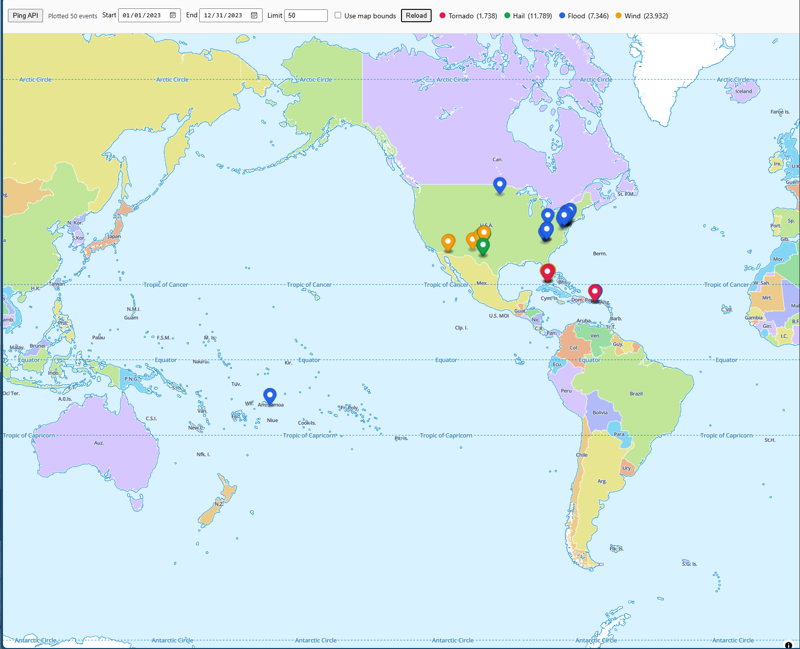
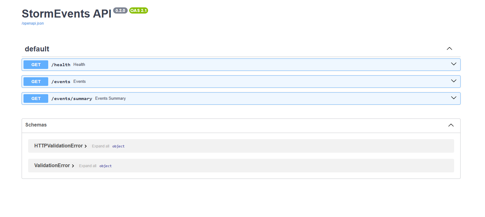

# Project A - StormEvents (FastAPI + DuckDB + GeoParquet)

Containerized API to explore NOAA StormEvents stored as GeoParquet.

- ETL: CSV -> (Geo)Parquet via Python
- Query: DuckDB in-place over local Parquet
- API: FastAPI with time + bbox filters and a groupby summary
- UI: Minimal MapLibre page to plot events

## Quickstart
```bash
python etl/noaa_etl.py      # generate parquet to data/parquet/stormevents/
docker compose up --build   # run API
# open http://localhost:8000/docs and web/index.html

## Screenshots


